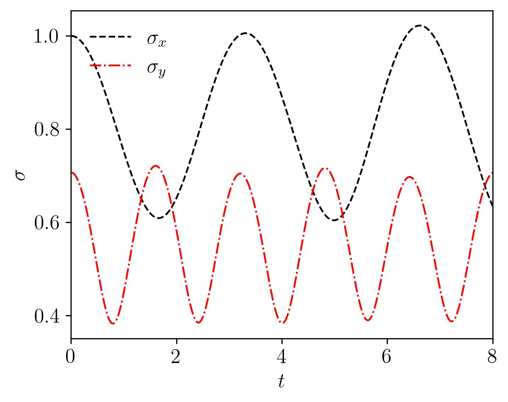
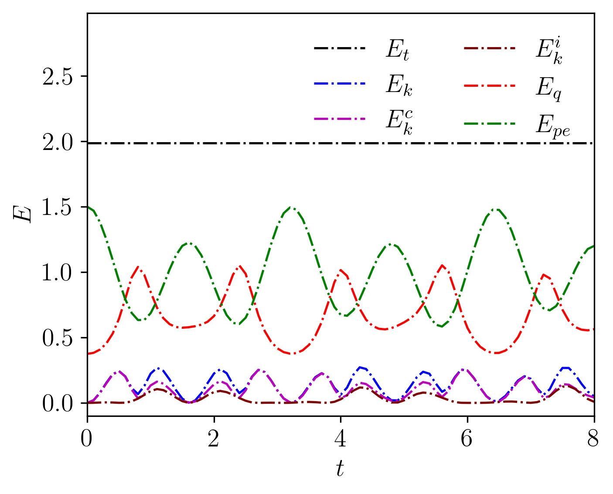
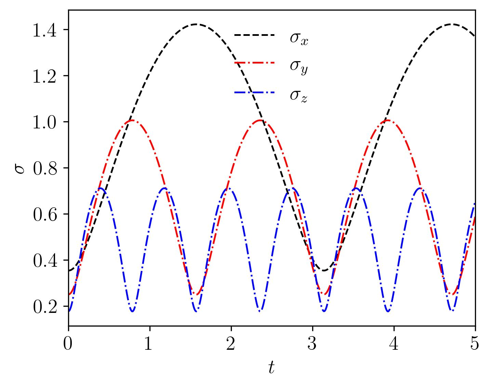
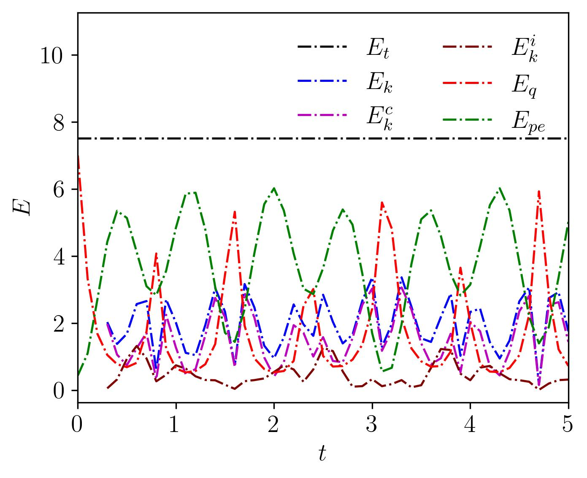

<!-- [](https://opensource.org/licenses/MIT) -->


**quTARANG** is a Python package designed for studying turbulence in quantum systems, specifically in atomic Bose-Einstein condensates (BECs), using the mean-field Gross-Pitaevskii equation (GPE). The non-dimensional GPE implemented in quTARANG is given by

$$
i\partial_t\psi(\vec{r},t) = -\frac{1}{2}\nabla^2\psi(\vec{r},t) + V(\vec{r},t)\psi(\vec{r},t) + g|\psi(\vec{r},t)|^2\psi(\vec{r},t),
$$

where $\psi(\vec{r},t)$ is the macroscopic, non-dimensionalized complex wave function, $V(\vec{r},t)$ is the non-dimensionalized external potential, and $g$ is the non-linearity coefficient governing interactions within the system.

This package is hardware-agnostic, allowing users to run simulations on either a CPU or a GPU by simply setting the `device` parameter in the `para.py` file, as explained below. **quTARANG** uses the Time-Splitting Pseudo-Spectral (TSSP) method for evolving the system, ensuring both efficiency and accuracy. Additionally, the package can compute stationary states by evolving the GPE in imaginary time. **quTARANG** also includes functions to compute various statistical quantities like spectra and fluxes and compute the energy spectra using a conventional binning method, and a more resolved spectra using the angle-averaged Wiener-Khinchin approach [see](https://journals.aps.org/pra/pdf/10.1103/PhysRevA.106.043322). 

The directory structure of **quTARANG** package is as follows:
<!-- ```
├── quTARANG
    ├── config
    ├── initial_cond
    ├── util
    ├── src
├── para.py
├── main.py
└── postprocessing
``` -->
- `quTARANG` directory contains the quTARANG's source files.
- `para.py` file is used to set the parameters required to perform a sumulaition.
- `main.py` is used to define the initial user conditions and is the file executed to start the simulation
- `postprocessing` directory contains libraries and tools used for data postprocessing, including:
    1. Computation and plotting of spectra (for various energies and particle numbers) using the conventional binning method, along with more detailed spectra using the angle-averaged Wiener-Khinchin approach.
    2. Computation and plotting of fluxes for particle number and different energies.
    3. Ploting of time series of energies as well as the the  root mean square (RMS) values of the condensate.


## Packages required to run quTARANG
The following Python packages need to be installed to run quTARANG

    * `numpy` : To run the code on a CPU,
    * `cupy` : To run the code on a GPU,
    * `h5py` : To save the output in HDF5 format,
    * `matplotlib` : To plot the data,
    * `pyfftw`,
    * `tqdm`,
    * `imageio` : To generate animation.


In addition to the above packages, the user can install LaTeX (preferably TeX Live) to generate symbols and numbers in a more refined format.


## Running quTARANG
Before starting the simulation, user need to configure the parameters and initial conditions. This is done using the para.py and main.py files, respectively.

### Description of `para.py` file.
```python
#para.py
#================================================================================
#                       Change the following parameters
#================================================================================
real_dtype = "float64"
complex_dtype = "complex128"

pi = 3.141592653589793

# Device Setting 
device = "cpu"             # Choose the device <"cpu"> to run on cpu and gpu to run on <"gpu">
device_rank = 1            # Set GPU no in case if you are running on a single GPU else leave it as it is

# Set grid size 
Nx = 256
Ny = 256
Nz = 1
    
# Set box length
Lx = 16
Ly = 16
Lz = 1

# Set maximum time and dt
tmax = 8    
dt = 0.001

# Choose the value of the non linerarity
g = 2

inp_type = "fun"       # Choose the initial condition type among <"fun">, <"dat"> and <"pdf">

type = "rp"            # In case of inp_type = "pdf" set the type of initial condition <"rp">, <"rv">, <"vl"> for 2D and <"rp"> for 3D.

# If inp_type = "dat" then set the input path
in_path = "/path/to/input_directory"

# Set output folder path
op_path = "/path/to/output_directory"

# Choose the scheme need to implement in the code
scheme = "TSSP"   

imgtime = False          # set <False> for real time evolution and <True> for imaginary time evolution
delta = 1e-12

overwrite = False

# Wavefunction save setting
wfc_start_step = 0

# make wfc_iter too big to stop saving the wfc 
wfc_iter_step = 500

# Rms save setting
save_rms = True
rms_start_step = 0
rms_iter_step = 10

# Energy save setting
save_en = True
en_start_step = 0
en_iter_step = 100

# Printing iteration step
t_print_step = 1000
```

The parameters within the para.py file are described as follows:

| Parameters | Description | Values |
|------------|-------------|--------|
| `real_dtype` | Specifies the precision of real arrays used in the code. | `"float32"`: Single precision. <br> `"float64"`: Double precision. |
| `complex_dtype` | Specifies the precision of complex arrays used in the code. | `"complex32"`: Single precision. <br> `"complex64"`: Double precision. |
| `device` | Specifies the device on which the code will execute. | `"cpu"`: Run the code on a CPU. <br> `"gpu"`: Run the code on a GPU. |
| `device_rank` | Specifies which GPU to use in multi-GPU systems, with values ranging from 0 to `(number of GPUs - 1)`. Default is 0. Leave unchanged if `device = "cpu"`. | `0` to `(number of GPUs - 1)`. |
| `Nx, Ny, Nz` | Specifies the grid sizes along the $x$-, $y$-, and $z$-axes. | Put `Ny=1`, `Nz=1` for 1-D and `Nz=1` for 2-D simulations. 
| `Lx, Ly, Lz` | Specifies the box lengths along the $x$-, $y$-, and $z$-axes. | Put `Ly=1`, `Lz=1` for 1-D and `Lz=1` for 2-D simulations. |
| `tmax, dt` | `tmax` sets the total simulation time, while `dt` determines the time step size. | |
| `g` | Sets the value of the nonlinearity parameter in the system. | |
| `inp_type` | This parameter determines how the initial condition is set in quTARANG. | `"fun"`: The initial condition is defined through a function (to be specified in `main.py`). <br> `"dat"`: Initial condition is provided through the two input wavefunction and potential files of `HDF5` file type. <br> `"pdf"`: The initial condition is set using predefined functions within the code. |
|`type`|When `inp_type="pdf"`, this parameter sets the type of initial condition for the code. For other `inp_type` values leave it unchanged.|2D: `"rp"`, `"rv"`, and `"vl"` correspond to smooth random phase, random vortices, and vortex lattice initial conditions, respectively. <br> 3D: `"rp"` corresponds to the smooth random phase initial condition|
| `in_path` | Specifies the directory containing the initial wavefunction and potential files when `inp_type = "dat"`. Leave unchanged if not applicable. | `"path/to/input/directory"` |
| `op_path` | Specifies the output directory, where simulation data will be stored. | `"path/to/output/directory"` |
| `scheme` | Specifies the numerical scheme. In current version, only TSSP is supported, so leave it unchanged. | `"TSSP"` |
| `imgtime` |  Determines whether the code computes the stationary state or evolves the system. | `True` (compute stationary state), `False` (evolve the system). |
| `delta` | Stopping criteria for stationary state computation (`imgtime = True`). It is the absolute difference in energy between consecutive steps, i.e., $\delta = \|E_n - E_{n-1}\|$. keep it unchanged in real-time evolution (`imgtime = False`). | |
| `overwrite` | Prevents overwriting of the data already present inside the output directory. | `True` (overwrite), `False` (do not overwrite). |
| `wfc_start_step`, `wfc_iter_step` | `wfc_start_step`: The number of iterations after which the wavefunction starts being saved. `wfc_iter_step`: The interval between subsequent wavefunction saves. | |
| `save_rms` | Specifies whether to save the time series of the root mean square (RMS) value of the condensate. | `True` (save), `False` (do not save). |
| `rms_start_step, rms_iter_step` | Controls RMS saving behavior. Similar to `wfc_start_step, wfc_iter_step` but for the RMS value, if `save_rms = True`. | |
| `save_en` | Specifies whether to save the time series of energy values. | `True` (save), `False` (do not save). |
| `en_start_step, en_iter_step` | Controls energy saving behavior. Similar to `wfc_start_step, wfc_iter_step` but for energy, if `save_en = True`. | |
| `t_print_step` | Specifies the intervals at which data will be printed to the terminal. | |


### Description of `main.py` file
Based on the type of input for initial condition (`inp_type="fun"`, `inp_type="dat"` and `inp_type="pdf"`), the following cases arises: 
#### Case I: Setting the initial condition by using function 
For `inp_type = "fun"` in `para.py`,
the user has to define the functions that generate the initial wavefunction and potential through the `main.py`.These functions will be generated using the following instances:

- `ncp`: An instance of either NumPy(for a CPU) or cuPy(for a GPU), depending on the device used for code execution.
- `grid`: An object containing the grids for the $x-, \ y-$, and $z-$ axes, stored in the `x_mesh`, `y_mesh`, and `z_mesh` variables, respectively.
The following is an example for $ \psi(\vec{r},0)=\left(\frac{1}{\sqrt{2}\pi}\right)^{1/2} e^{-(x^2+2y^2)/4}$ and $V(\vec{r},0)=\frac{1}{2}(x^2+4y^2)$.

```python
#main.py
from quTARANG.src.lib import gpe
from quTARANG.src import evolution
from quTARANG.src.univ import grid, fns
from quTARANG.config.config import ncp
import quTARANG.config.mpara as para

##########################################################################
V = 0.5*(grid.x_mesh**2 + 4*grid.y_mesh**2)
def wfcfn():
    return 1/ncp.sqrt(ncp.sqrt(2)*ncp.pi)*ncp.exp(-(grid.x_mesh**2 + 2*grid.y_mesh**2)/4)

def potfn(t):
    return V + 0*t

G = gpe.GPE(wfcfn = wfcfn, potfn = potfn)
##########################################################################

evolution.time_advance(G)
```
The potential function can be time dependent potential and **always** takes a input parameter `t` and user can defines potential fuction which depends on `t` or not. Once the functions are defined the user needs to pass these functions to the instance of the `gpe` class as `G = gpe.GPE(wfcfn = wfc_func, potfn = pot_func)`, where `wfc_func` and `pot_func` are the user defined functions for inital wavefunction and potential respectively.  

#### Case II: Setting initial condtion using predefined initial conditoin or  by using wavefunction and potential file of `HDF5` type
When `inp_type = "dat"` or `inp_type = "pdf"`in `para.py`, the `main.py` will remain same. For `inp_type = "dat"`, the user must provide the path to the directory containing the wavefunction and potential data using the `inp_path` parameter in the `para.py` file. This directory must contain two HDF5 files: `wfc.h5`, which should include a dataset named `wfc` with the wavefunction data, and `pot.h5`, which should contain a dataset named `pot` with the potential data. The following will be the `main.py` file corresponding to this case. 

> **Note:** The HDF5 files utilize datasets to store the data.

```python
#main.py
from quTARANG.src.lib import gpe
from quTARANG.src import evolution
from quTARANG.src.univ import grid, fns
from quTARANG.config.config import ncp
import quTARANG.config.mpara as para

##########################################################################
G = gpe.GPE()
##########################################################################

evolution.time_advance(G)
```

Once the `para.py` and `main.py` file sets, the one can run the simulations using:
```python
python3 main.py
```

## Ouputs
When the simulation completes successfully, the output files will be generated inside the output directory. The files are stored in `HDF5` format. In case of the dynamical evolution (`imgtime = False` in `para.py`), the following directories/files are generated inside the output directory.:
- `wfc` : The `wfc` directory stores wavefunctions at different points in time. The filenames follow the format `wfc_<time>.h5`, where `<time>` represents the simulation time at which the wavefunction was saved. For example, `wfc_10.000000.h5` indicates that the wavefunction was saved at time $t = 10$. In each file the data is saved in the `wfc` dataset.
- `pot.h5` : This file contains the data for the potential at `t=0` and in this file data is saved in `pot` dataset. 
- `energies.h5` : This file contains the different types of energies saved at the times mentioned in the `para.py` file. This file will only be generated if the `save_en` parameter within `para.py` file is set to *`True`*.
- `rms.h5` : Similaraly, this files contains the RMS values: $x_{rms}, \ y_{rms}$, $r_{rms}$ for a 2-D run, and $x_{rms}, \ y_{rms} \ z_{rms}$, $r_{rms}$ for a 3-D runs. Like `energies.h5` file, this file will also only be generated if `save_rms` parameter within `para.py` file is set to *`True`*.

- `para.py` and `main.py`: These are copies of the original parameter and main program files (`para.py` and `main.py`) used at the time the simulation was run. These files allow user check the initial condition and parameters used for the generated data.

While in case of computing the stationary state (`imgtime = True` in `para.py`) a wavefunction directory containg the wavefunctions at different time iterations and at the end of the iterations will generate. The filenames follow the format `wfc_<iterations>.h5`, where `<iterations>` represents the no of iterations after which the wavefunction was saved. For example, `wfc_1000.h5` indicates that the wavefunction was saved at the end of $1000$ iteration. The wavefuntion whoose iteration number is largest among all the wavefucntion will be the wavefuction corresponding to the ground state of the syste. In each wavefucntion file the data is saved in the `wfc` dataset.

## Postprocessing 
Once the output from ***quTARANG*** has been generated in the output directory, users can post-process the data using the files within the `postprocessing` directory. The structure of the directories and files within the `postprocessing` directory are as follows:

<!-- ```
├── src
├── op_path.py    
├── plot_energy.py
├── plot_rms.py
└── plot_spectra.ipynb
``` -->

The `src` directory contains the classes and fucntions for the computation of spectra, fluxes and generation of animation. While in `op_path.py` users  needs to set the location of the output data directory. After setting this location, users can plot energy and RMS evolution by running `plot_energy.py` and `plot_rms.py`, respectively. The plots and anmations correspoending to the density and phase will be generated using the jupyter notebook named `plot_animation.ipynb` while the spectra and flux plots can be generated using the jupyter notebook `plot_spectra.ipynb`. The comments in the cells of these notebooks explain the usage of each of the functions inside these notebooks. The output plots will be stored in a newly created subdirectory named `postprocessing` within the original output directory. 

## Test cases

1. 2D case:  

    $$ \psi(\vec{r},0)=\left(\frac{1}{\sqrt{2}\pi}\right)^{1/2} e^{-(x^2+2y^2)/4} $$

    $$V(\vec{r},0)=\frac{1}{2}(x^2+4y^2)$$ 

    The `main.py` and `para.py` file corresponding to the above case are as follows: 

    ```python
    #main.py
    from quTARANG.src.lib import gpe
    from quTARANG.src import evolution
    from quTARANG.src.univ import grid, fns
    from quTARANG.config.config import ncp
    import quTARANG.config.mpara as para

    ##########################################################################
    V = 0.5*(grid.x_mesh**2 + 4*grid.y_mesh**2)
    def evolve_wfc2d():
        return 1/ncp.sqrt(ncp.sqrt(2)*ncp.pi)*ncp.exp(-(grid.x_mesh**2 + 2*grid.y_mesh**2)/4)

    def evolve_pot2d(t):
        return V + 0*t

    G = gpe.GPE(wfcfn = evolve_wfc2d, potfn = evolve_pot2d)
    ##########################################################################

    evolution.time_advance(G)
    ```

    ```python
    #para.py
    #=======================================#================================================================================
    #                       Change the following parameters
    #================================================================================
    real_dtype = "float64"
    complex_dtype = "complex128"

    pi = 3.141592653589793

    # Device Setting 
    device = "gpu"             # Choose the device <"cpu"> to run on cpu and gpu to run on <"gpu">
    device_rank = 1            # Set GPU no in case if you are running on a single GPU else leave it as it is

    # Set grid size 
    Nx = 256
    Ny = 256
    Nz = 1
        
    # Set box length
    Lx = 16
    Ly = 16
    Lz = 1

    # Set maximum time and dt
    tmax = 8    
    dt = 0.001

    # Choose the value of the non linerarity
    g = 2

    inp_type = "fun"       # Choose the initial condition type among <"fun">, <"dat"> and <"pdf">

    type = "rp"            # In case of inp_type = "pdf" set the type of initial condition <"rp">, <"rv">, <"vl"> for 2D and <"rp"> for 3D.

    # If inp_type = "dat" then set the input path
    in_path = "/path/to/input_directory"


    # Set output folder path
    op_path = "../output_evolve2D"

    # Choose the scheme need to implement in the code
    scheme = "TSSP"          # Choose the shemes <"TSSP">, <"RK4"> etc

    imgtime = False          # set <False> for real time evolution and <True> for imaginary time evolution
    delta = 1e-12


    # To resume the Run
    resume = False

    overwrite = False

    # Wavefunction save setting
    wfc_start_step = 0

    # make wfc_iter too big to stop saving the wfc 
    wfc_iter_step = 500

    # Rms save setting
    save_rms = True
    rms_start_step = 0
    rms_iter_step = 10

    # Energy save setting
    save_en = True
    en_start_step = 0
    en_iter_step = 100

    # Printing iteration step
    t_print_step = 1000


    ```
    Once the output has been generated, the user can postprocess the data by first setting the `path` variable in the `op_path.py` file located in the `postprocessing` directory. This variable should correspond to the path of the output directory, after which the user can perform the analysis.

    The following plots shows the RMS and energy results generated by running `plot_rms.py` and `plot_energy.py` for the date generated corresponding to this example:

    |  |  |
    |:---------------------:|:----------------------:|

2. 3D case:

    $$\psi(\vec{r},0)=\left(\frac{8}{\pi}\right)^{3/4}\text{exp}(-2x^2-4y^2-8z^2)$$

    $$V(\vec{r},0)=\frac{1}{2}(x^2+4y^2+16z^2)$$

    The `main.py` and `para.py` file corresponding to the above case are as follows: 

    ```python
    #para.py
    #================================================================================
    #                       Change the following parameters
    #================================================================================
    real_dtype = "float64"
    complex_dtype = "complex128"

    pi = 3.141592653589793

    # Device Setting 
    device = "gpu"             # Choose the device <"cpu"> to run on cpu and gpu to run on <"gpu">
    device_rank = 0            # Set GPU no in case if you are running on a single GPU else leave it as it is

    # Set grid size 
    Nx = 256
    Ny = 256
    Nz = 256
        
    # Set box length
    Lx = 16
    Ly = 16
    Lz = 16

    # Set maximum time and dt
    tmax = 5    
    dt = 0.001

    # Choose the value of the non linerarity
    g = 0.1

    inp_type = "fun"        # Choose the initial condition type among <"fun">, <"dat"> and <"pdf">

    type = "rp"            # In case of inp_type = "pdf" set the type of initial condition <"rp">, <"rv">, <"vl"> for 2D and <"rp"> for 3D.

    # If inp_type = "dat" then set the input path
    in_path = "/path/to/input_directory"

    # Set output folder path
    op_path = "../output_evolve3D"

    # Choose the scheme need to implement in the code
    scheme = "TSSP"          # Choose the shemes <"TSSP">, <"RK4"> etc

    imgtime = False          # set <False> for real time evolution and <True> for imaginary time evolution
    delta = 1e-12


    # To resume the Run
    resume = False

    overwrite = False

    # Wavefunction save setting
    wfc_start_step = 0

    # make wfc_iter too big to stop saving the wfc 
    wfc_iter_step = 500

    # Rms save setting
    save_rms = True
    rms_start_step = 0
    rms_iter_step = 10

    # Energy save setting
    save_en = True
    en_start_step = 0
    en_iter_step = 100

    # Printing iteration step
    t_print_step = 1000

    ```
    ```python
    #main.py
    from quTARANG.src.lib import gpe
    from quTARANG.src import evolution
    from quTARANG.src.univ import grid, fns
    from quTARANG.config.config import ncp
    import quTARANG.config.mpara as para

    ##########################################################################
    V = 0.5*(grid.x_mesh**2 + 4 * grid.y_mesh**2 + 16 * grid.z_mesh**2)
    def evolve_wfc3d():
        return (8/ncp.pi)**(3/4)*ncp.exp(-2*(grid.x_mesh**2 + 2 * grid.y_mesh**2 + 4 *grid.z_mesh**2))

    def evolve_pot3d(t):
        return V + 0*t

    G = gpe.GPE(wfcfn = evolve_wfc3d, potfn = evolve_pot3d)
    ##########################################################################

    evolution.time_advance(G)
    ```

    The following plots shows the RMS and energy results generated by running `plot_rms.py` and `plot_energy.py` for the date generated corresponding to this example:

    |  |  |
    |:---------------------:|:----------------------:|

